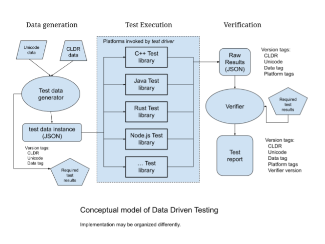

# Unicode & CLDR Data Driven Test

This repository provides tools and procedures for verifying that an
implementation is working correctly according to the data-based
specifications. The tests are implemented on several platforms including NodeJS
(JavaScript), ICU4X (RUST), ICU4C, etc. Additional programming platforms may be
added to use the test driver framework.

The goal of this work is an easy-to-use framework for verifying that an
implementation of ICU functions agrees with the required behavior. When a DDT
tet passes, it a strong indication that output is consistent across platforms.

Data Driven Test (DDT) focuses on functions that accept data input such as
numbers, date/time data, and other basic information. The specifications
indicate the expected output from implementations when given the data and
argument settings for each of the many individual data items.

Note that these tests are only part of the testing required for ICU-compliant
libraries. Many additional tests are implmeneted in the

* !!! TODO: reference to data specifications

# Components of Data Driven Test

## Architectural Overview

Conceptually, there are three large functional units of the DDT implementation:



## Data generation:

Utilizes Unicode (UTS-35) specifications, CLDR data, and existing ICU test
data. Existing ICU test data has the advantage of being already structured
towards data driven testing, is in many cases formatted in a way to simplify
adding new tests, and contains edge and error cases.

Data generation creates two files:
* test data instance: a JSON file functions and parameters to be applied to the
  given data
* A required test result file (JSON) containing the expected results from each
  of the inputs. This could be called the “golden data”.


## Text Execution:

Test execution consists of a Test Driver script and implementation-specific
executables.  The test driver executes each of the configured test
implementation executables, specifying the input test data and the location for
storing results.  STDIN and STDOUT are the defaults.

### Test executors

Each test executor platform contains a main routine that accepts a test request
from the test driver, calling the tests based on the request data.

Each executor parses the data line sent by the test driver, extracting elements
to set up the function call the the particular test.

For each test, the needed functions and other objects are created and the test
is executed. Results are saved to a JSON output file.

See [executors/README][./executors/README.md] for more details

## Verification:

Each test is matched with the corresponding data from the required test
results. A report of the test results is generated. Several kinds of status
values are possible for each test item:

* Success: the actual result agrees with
expected results
* Failure: a result is generated, but the result is not the same
as the expected value.
* No test run: The test was not executed by the test
implementation for the data item
* Error: the test resulted in an exception or
other behavior not anticipated for the test case

### Open questions for the verifier:
* What should bedone if the test driver fails to complete? How can this be determined?

    * Proposal: each test execution shall output a completion message,
indicating that the test driver finished its execution normally, i.e., did not
crash.

# How to use DDDT:

# History:

Data Driven Test was initiated in 2022 at Google. The first release of the
package was delivered in October, 2022.

# LICENSE

See [LICENSE](./LICENSE)

```
SPDX-License-Identifier: Unicode-DFS-2016
```
